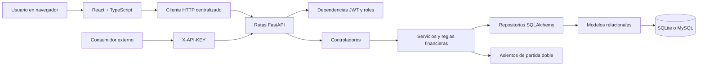
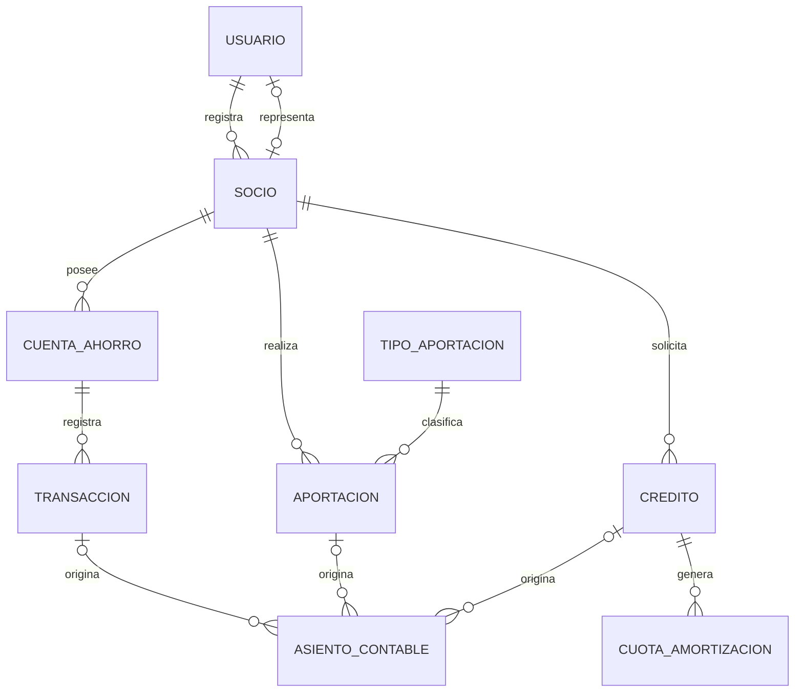
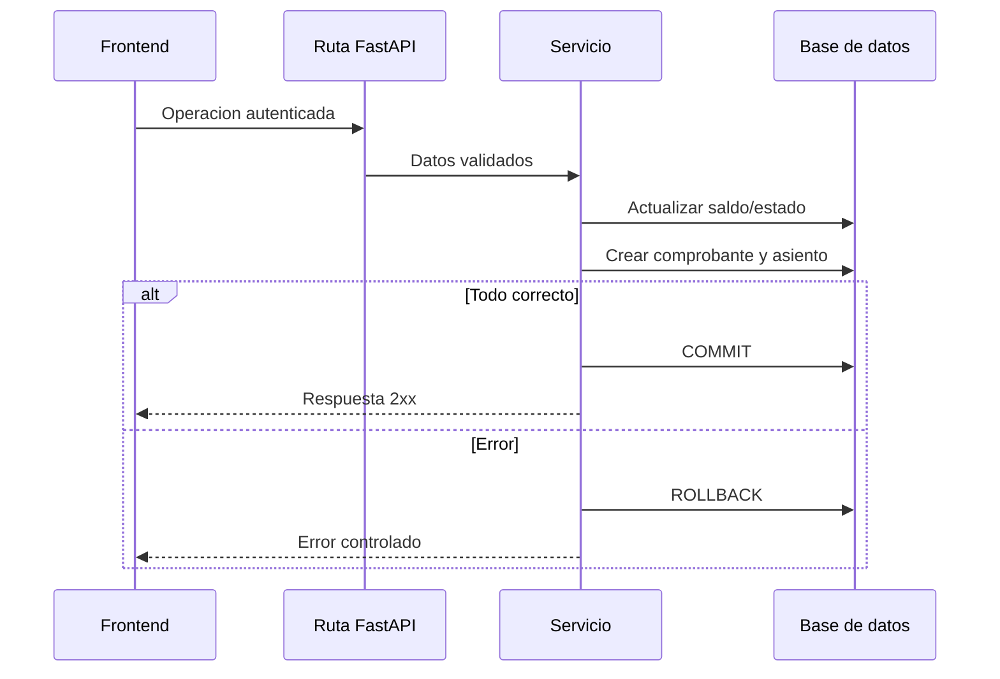

# Arquitectura completa

## Vista general

## Backend por capas

| Capa | Responsabilidad | Ubicacion |
|---|---|---|
| Ruta | HTTP, dependencias, respuesta y Swagger | `app/rutas` |
| Controlador | Adaptacion entre ruta y dominio | `app/controladores` |
| Servicio | Reglas, estados y transacciones | `app/servicios` |
| Repositorio | Consultas ORM | `app/repositorios` |
| Modelo | Entidades, llaves y relaciones | `app/modelos` |
| Esquema | Validacion de entrada y salida | `app/esquemas` |
| Utilidad | Seguridad, fechas y codigos | `app/utilidades` |

## Modelo de datos

Las columnas monetarias utilizan `Numeric(12, 2)` y la logica opera con
`Decimal`. Cedula, numero de socio, numero de cuenta, numero de credito, usuario
y correo tienen restricciones de unicidad segun su modelo.

## Transacciones financieras

Depositos, retiros, aportaciones, desembolsos y pagos actualizan las entidades
relacionadas y generan el asiento antes de confirmar. `confirmar_transaccion`
ejecuta `commit` y realiza `rollback` si ocurre una excepcion.

## Seguridad

- BCrypt para contrasenas.
- JWT con expiracion y usuario activo.
- Dependencias de roles en el backend.
- Filtrado de recursos propios para SOCIO.
- API externa separada por `X-API-KEY`.
- CORS configurable mediante `ORIGENES_CORS`.
- Consultas parametrizadas por SQLAlchemy.
- Archivos `.env`, bases y artefactos fuera de Git.

## Persistencia

SQLite permite demostracion local. MySQL usa la misma capa SQLAlchemy y se
configura con `DATABASE_URL`. No existe Alembic: `create_all` y migraciones
ligeras mantienen el esquema academico actual, pero un despliegue productivo
debe incorporar migraciones versionadas.

## Despliegue

Vite genera `frontend/dist`. Si existe, FastAPI monta sus recursos y resuelve
las rutas SPA. En desarrollo se ejecutan Vite 5173 y FastAPI 8000 por separado.
