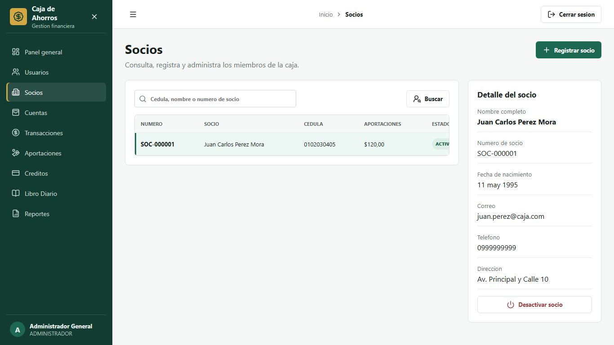
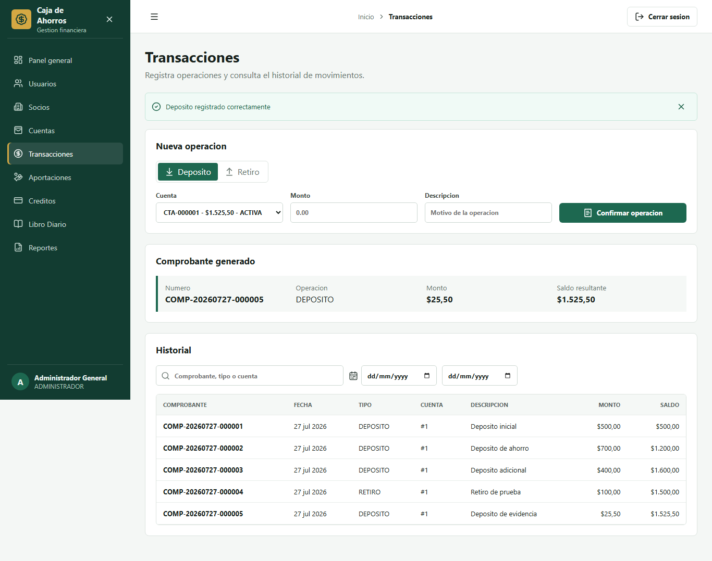
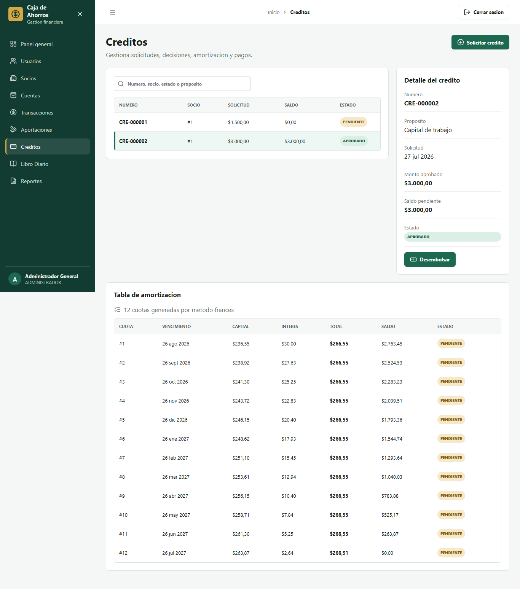
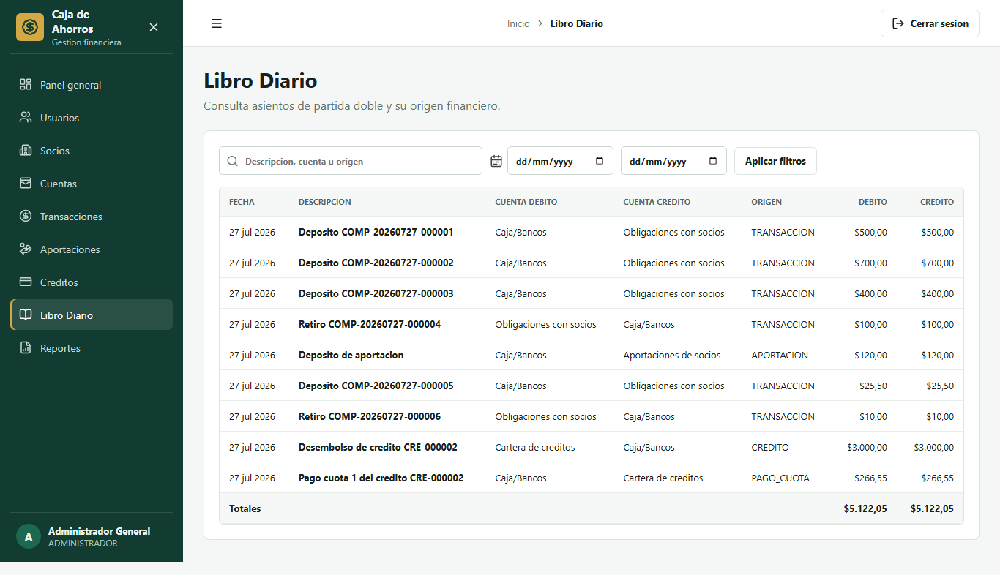
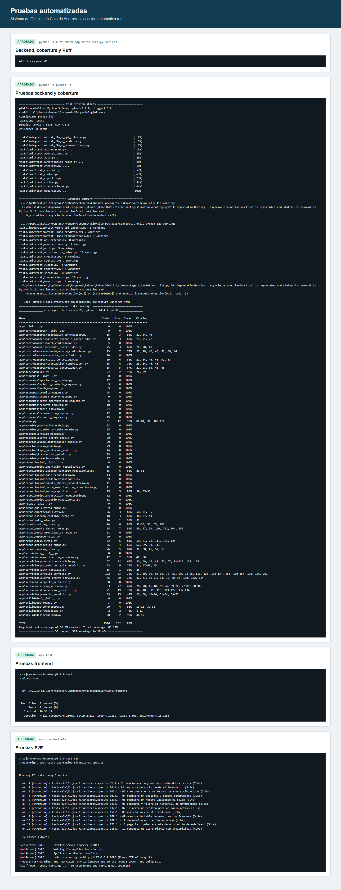
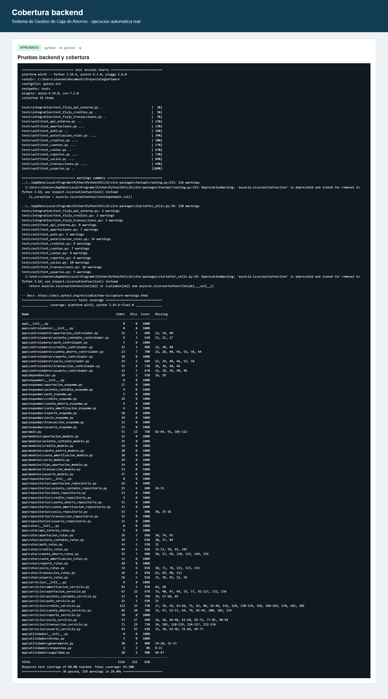
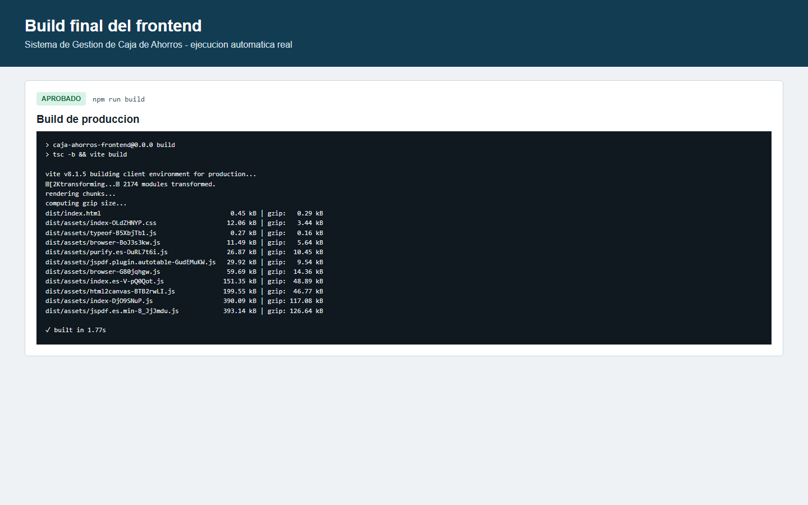

# Proyecto Final - Sistema de Gestion de Caja de Ahorros

**Asignatura:** Ingenieria de Software  
**Grupo:** Grupo 01  
**Integrante:** Steeven Ariel Martinez Campos  
**Fecha:** 26 de julio de 2026  
**Repositorio:** https://github.com/steevenmc04/Proyecto-Ing-Software

## 1. Objetivos

El objetivo general fue completar una aplicacion web que integre los
requerimientos, diseno, backend y pruebas de las tareas anteriores. La entrega
debia ser demostrable de principio a fin, mantener integridad financiera,
restringir funciones por rol y conservar trazabilidad entre requisitos,
implementacion, pruebas y evidencias.

Los objetivos especificos fueron construir una interfaz React responsiva,
consumir la API FastAPI real, reforzar autenticacion y autorizacion, validar los
flujos de ahorros y creditos, automatizar calidad y dejar documentacion
reproducible para usuarios, desarrolladores y evaluadores.

## 2. Descripcion del proyecto

El Sistema de Gestion de Caja de Ahorros administra usuarios, socios, cuentas,
depositos, retiros, aportaciones, creditos, cuotas, asientos contables y
reportes. La informacion visible se obtiene de la base de datos. No se usan
datos codificados en el frontend para simular operaciones.


## 3. Arquitectura

El backend mantiene el esquema exigido:

```text
Ruta -> Controlador -> Servicio -> Repositorio -> Modelo -> Base de datos
```

FastAPI recibe y valida la solicitud; el controlador adapta la operacion; el
servicio aplica reglas y transacciones; el repositorio consulta mediante
SQLAlchemy; el modelo conserva relaciones e integridad. React usa un cliente
HTTP centralizado, contexto de autenticacion, rutas protegidas y modulos por
dominio. SQLite es el modo local y MySQL se configura con `DATABASE_URL`.

## 4. Tecnologias

- Backend: Python, FastAPI, Pydantic, SQLAlchemy, JWT y BCrypt.
- Base de datos: SQLite o MySQL mediante PyMySQL.
- Frontend: React 19, TypeScript 6, Vite 8 y React Router.
- Formularios: React Hook Form y Zod.
- Reportes: jsPDF y write-excel-file.
- Calidad: Pytest, Coverage, Ruff, Vitest, ESLint y Playwright.
- Automatizacion: PowerShell y GitHub Actions.

## 5. Modulos

- Autenticacion y sesion.
- Usuarios y roles.
- Socios.
- Cuentas de ahorro.
- Depositos, retiros y comprobantes.
- Aportaciones.
- Creditos y amortizacion francesa.
- Desembolsos y pagos.
- Libro Diario.
- Reportes PDF y XLSX.
- API externa protegida con `X-API-KEY`.

## 6. Integracion frontend-backend

`frontend/src/servicios/clienteApi.ts` obtiene la URL desde `VITE_API_URL`,
adjunta el JWT y normaliza errores HTTP. El backend comprueba nuevamente el rol;
ocultar opciones en React no sustituye la seguridad. Los endpoints `mis-*`
filtran cuentas, movimientos y creditos por el socio asociado al usuario.



## 7. Flujo de ahorros

El cajero registra un socio, abre una cuenta con saldo cero y ejecuta depositos
o retiros. Cada movimiento valida estado y monto, actualiza saldo, crea
comprobante y genera un asiento contable antes del commit. Si una escritura
falla, se ejecuta rollback.



## 8. Flujo de creditos

Todo credito inicia pendiente. GERENTE o ADMINISTRADOR decide; al aprobar se
genera la amortizacion francesa con `Decimal`. CAJERO o ADMINISTRADOR puede
desembolsar y registrar pagos. Las cuotas, el saldo y el asiento se actualizan
en la misma transaccion.



## 9. Contabilidad y reportes

Depositos, retiros, aportaciones, desembolsos y pagos generan partida doble. El
Libro Diario conserva origen, debito y credito iguales. Los reportes se
calculan desde la API y pueden exportarse.



## 10. Seguridad

- Contrasenas hasheadas con BCrypt.
- JWT con expiracion y validacion de usuario activo.
- Permisos por ADMINISTRADOR, GERENTE, CAJERO, CONTADOR y SOCIO.
- Recursos propios para SOCIO.
- CORS limitado por `ORIGENES_CORS`.
- Consultas ORM parametrizadas.
- Secretos en `.env`, nunca en Git.
- API externa separada mediante `X-API-KEY`.

## 11. Pruebas

La verificacion final ejecuto:

```text
ruff check app tests seed.py scripts
pytest -q
npm run lint
npm test
npm run build
npm run test:e2e
```

Resultados: Ruff y ESLint aprobados; 38 pruebas backend aprobadas; 8 pruebas
frontend aprobadas; 12 flujos E2E aprobados en Chromium.



## 12. Cobertura

Pytest midio 1.516 sentencias del paquete `app`: 252 no cubiertas y 83.38% de
cobertura total. El umbral configurado es 80% y supera el minimo solicitado de
70%.



## 13. Build

`npm run build` compilo TypeScript y transformo 2.174 modulos con Vite 8.1.5.
El paquete principal fue de 390,09 kB, 117,08 kB comprimido. FastAPI sirve
`frontend/dist` cuando existe.



## 14. Repositorio

Repositorio publico:
https://github.com/steevenmc04/Proyecto-Ing-Software

El repositorio incluye scripts de instalacion, inicio y verificacion; variables
de ejemplo; contrato de 58 operaciones generado desde OpenAPI; manuales;
trazabilidad; CI y evidencias. No contiene `node_modules`, bases locales,
entornos virtuales, secretos ni archivos de cobertura.

## 15. Historial de trabajo

La auditoria encontro 26 commits existentes. La entrega final alcanza 32
commits reales, por encima del minimo de 20. Los commits principales del cierre
son:

- `525c4a4` - docs: registrar auditoria y plan final.
- `1f0332e` - fix: reforzar seguridad e integridad backend.
- `44fad41` - feat: implementar frontend operativo.
- `137fd52` - test: automatizar calidad y flujos financieros.
- `a6dc9df` - docs: completar manuales y trazabilidad.
- `version final` - informe, evidencias y revision de cierre.

No se atribuyeron commits a integrantes no confirmados.

## 16. Resultados

El sistema permite demostrar login, socio, cuenta, deposito, retiro, solicitud,
aprobacion, amortizacion, desembolso, pago, asiento y reporte. Swagger esta
disponible en `/docs`, ReDoc en `/redoc` y salud en `/api/v1/salud`. El
frontend funciona por separado con Vite o integrado en FastAPI tras el build.

La entrega queda preparada para despliegue, pero no se declara una URL remota
porque no se proporcionaron proveedor ni credenciales.

## 17. Conclusiones

El desarrollo del Sistema de Gestion de Caja de Ahorros permitio integrar en
una sola solucion los requerimientos funcionales, el diseno por capas, la
persistencia relacional, una interfaz web moderna y una estrategia de calidad
automatizada. El resultado demuestra que una arquitectura
ruta-controlador-servicio-repositorio-modelo facilita separar las decisiones
del negocio de la comunicacion HTTP y del acceso a datos. Esta separacion fue
especialmente importante en depositos, retiros, aportaciones, desembolsos y
pagos, porque cada operacion debe mantener coherencia entre saldo, comprobante
y asiento contable.

La incorporacion de autenticacion JWT, validacion de usuario activo, permisos
por rol y filtrado de recursos propios reduce el riesgo de acceso indebido. El
rol SOCIO no depende solamente de opciones ocultas en la interfaz: el backend
limita las consultas a las cuentas, movimientos y creditos asociados. Asimismo,
el uso de `Decimal`, restricciones relacionales y rollback protege la
integridad de los datos financieros.

Las 38 pruebas backend, 8 pruebas frontend y 12 recorridos E2E ofrecen evidencia
repetible de los flujos principales. La cobertura de 83.38% supera el umbral
establecido y el build de produccion confirma que la interfaz puede
distribuirse. La documentacion de arquitectura, contrato, trazabilidad,
manuales, tareas y evidencias facilita la evaluacion y el mantenimiento.

Como siguiente etapa, un despliegue productivo deberia incorporar migraciones
Alembic, secretos administrados por el proveedor, HTTPS, monitoreo y una
version de React Router que cierre el aviso asociado a RSC. Estas mejoras no
impiden la demostracion local actual, pero son necesarias para operar el
sistema fuera del contexto academico.

## 18. Anexos

- `docs/CONTRATO_API.md`: 58 operaciones reales.
- `docs/MATRIZ_TRAZABILIDAD.md`: RF-001 a RF-022.
- `docs/PLAN_PRUEBAS.md`: niveles, casos y criterios.
- `docs/MANUAL_USUARIO.md`: operacion por modulo.
- `docs/MANUAL_TECNICO.md`: instalacion y mantenimiento.
- `docs/GUION_EXPOSICION.md`: exposicion de 8 a 12 minutos.
- `docs/evidencias/`: 17 capturas verificables.

